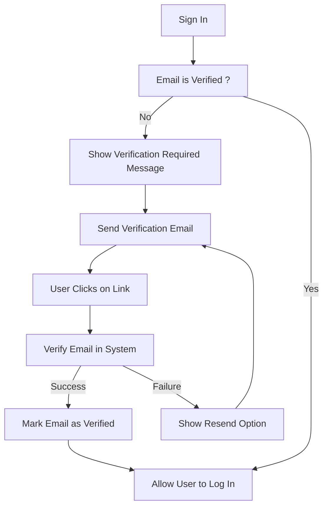
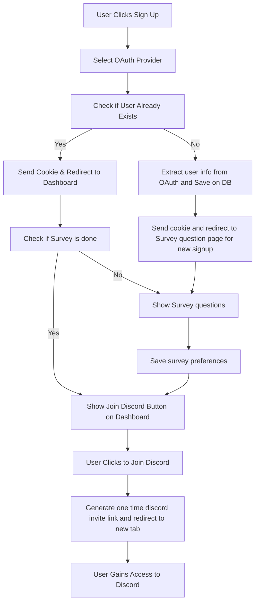

# Feature Flow Documentation

This document contains the flow of different features of the application. It is based on the details provided in the [PRD - Product Requirement Document](./PRD.md). All feature flows are represented using [Mermaid](https://mermaid.js.org/), which are supported by GitHub Markdown. You can learn Mermaid [here](https://www.youtube.com/watch?v=qGsQolMh9zE).

### Example Feature Flow For Sigin After Email Verification

## Features

- [User Signup and Discord Access/link](#user-signup-and-discord-accesslink)
- [Normal User → Contributor Conversion](#normal-user--contributor-conversion)
- [Normal User → Recruiter Conversion](#normal-user--recruiter-conversion)
- [Contributor Asking for Feedback](#contributor-asking-for-feedback)
- [Lead Providing Feedback](#lead-providing-feedback)
- [Contributor Asking for Mock Interviews](#contributor-asking-for-mock-interviews)
- [Connecting/Verifying External Accounts](#connectingverifying-external-accounts)
- [User Accessing Profile and Stats](#user-accessing-profile-and-stats)
- [Admin Creating Discord Events](#admin-creating-discord-events)
- [Admin Approving Role Promotion](#admin-approving-role-promotion)
- [Admin Accessing Pools and Stats](#admin-accessing-pools-and-stats)
- [Admin Adding User to Project Manually](#admin-adding-user-to-project-manually)

### User Signup and Discord Access/link
Ask survey QA on signup to gather user preferences and link their Discord account.

### Normal User → Contributor Conversion
Allow normal users to convert to contributors by completing a survey QA.

### Normal User → Recruiter Conversion
Enable normal users to convert to recruiters and access the contributor pool.

### Contributor Asking for Feedback
Contributors can request feedback on their tasks or projects.

### Lead Providing Feedback
Leads can provide detailed feedback to contributors.

### Contributor Asking for Mock Interviews
Contributors can request mock interviews to improve their skills.

### Connecting/Verifying External Accounts
Users can connect and verify external accounts like GitHub, LinkedIn, and Twitter.

### User Accessing Profile and Stats
Users can view their profile and stats, including feedback and mock interview reviews.

### Admin Creating Discord Events
Admins can create events on Discord to engage the community.

### Admin Approving Role Promotion
Admins can approve role promotions for users based on their performance.

### Admin Accessing Pools and Stats
Admins can access contributor pools, website stats, and mock interview requests.

### Admin Adding User to Project Manually
Admins can manually add users to projects as needed.
