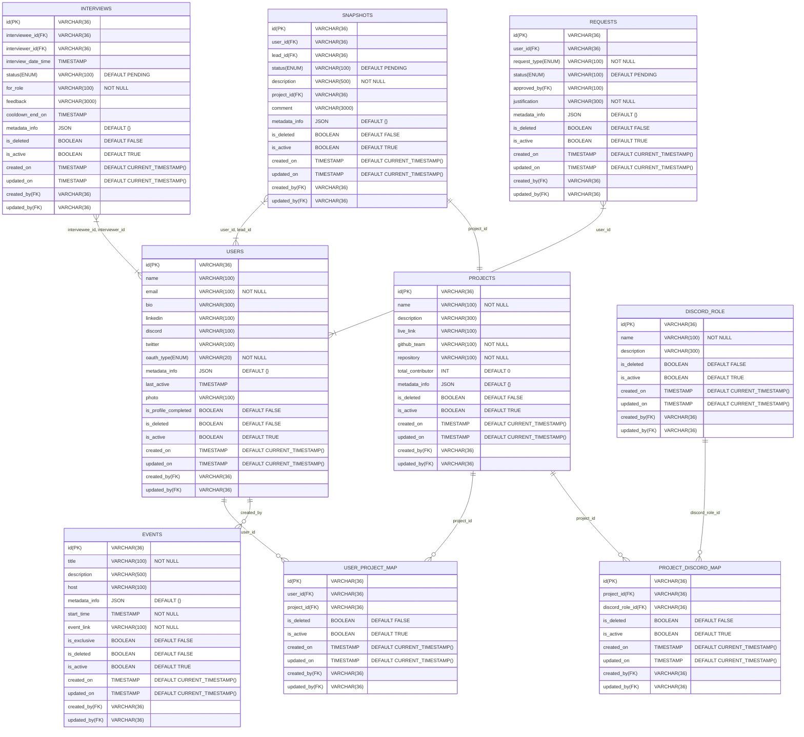

## Overview

[Team.shiksha 2.0](https://team.shiksha/) is a thriving learning community designed for students, freshers, and working professionals. It fosters skill development by simulating a corporate work environment, providing hands-on projects and real-world tasks similar to those encountered in the industry. 

Application introduces features that enable users of all types to engage with the community and pursue their passions. It helps users understand their current skill level and guides them on how to progress further by providing a structured roadmap and regular feedback at defined intervals.

### Jump To 

- [Architecture](#architecture)
- [API Design](#api-design)
- [Data Model](#data-model)
- [Security and Authentication](#security-and-authentication)
- [Scalability & Performance](#scalability--performance)
- [Deployment Strategy](#deployment-strategy)
- [Failure Handling & Monitoring](#failure-handling--monitoring)

## Architecture
TBC

## API Design

The API layer serves as the backbone of the application, enabling seamless communication between the frontend and backend systems. Below are the key aspects of the API design:

### Design Principles
- **RESTful Architecture**: The APIs follow REST principles to ensure scalability and simplicity.
- **Versioning**: All APIs are versioned (e.g., `/v1/`) to maintain backward compatibility.

### Example
TBC

## Data Model

Data modeling occurs at three main levels, each with increasing specificity as you move from conceptual to physical. These levels represent different stages in the database design process.

### Conceptual Data Model
A conceptual data model is a high-level overview that identifies the main entities and their relationships without implementation details.

### Logical Data Model
A logical data model expands on the conceptual model by adding attributes, defining keys, and normalizing relationships, but remains independent of any specific database technology.

> [!NOTE]
> Audit table will be added for keeping the audit information for destructive or intensive tasks, which is not present in this diagram as this table might not be related to any table present here.

### Physical Data Model
A physical data model translates the logical model into a specific database implementation with detailed specifications for storage and performance optimization. The below database physical model is for MySQL.

### Entity-Relationship Diagram
An Entity-Relationship diagram (ERD) is a conceptual, logical or physcial representation that shows Entities (objects or concepts), Relationships between entities, Attributes of entities, and Cardinality of relationships. ER diagrams are typically created early in the design process and focus on business concepts rather than implementation details. Diagram provided in the `Physical Data Model` section can be considered as the ER diagram.

## Security and Authentication

Security and authentication are critical components of any technical system. Our authentication system will use OAuth with the following identity providers:
- [Google OAuth](https://developers.google.com/identity/protocols/oauth2)
- [Discord OAuth](https://discord.com/developers/docs/topics/oauth2)
- [GitHub OAuth](https://docs.github.com/en/apps/oauth-apps/building-oauth-apps/creating-an-oauth-app)

This provides several advantages:

- Leverages established security infrastructure of major platforms
- Reduces password fatigue for users
- Simplifies onboarding with familiar login options
- Delegates account security concerns to trusted providers

Some security considerations are given below:

### Token Management

- Access Tokens: Short-lived JWTs (15 minutes) with appropriate scopes
- Refresh Tokens: Longer-lived(30 days) tokens stored securely to obtain new access tokens

### Rate Limiting

- Implementation of rate limiting to prevent resource consumption and expliotation.
- IP address based server side rate limiting.
- Rate limit headers in responses.

## Scalability & Performance
TBC

## Deployment Strategy
TBC

## Failure Handling & Monitoring
TBC
